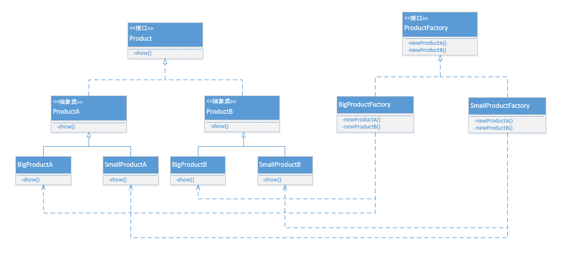

# 工厂模式
## 一、工厂方法模式
工厂方法模式是典型的解耦框架，是 *new* 一个对象的替代品，有 4 个角色/组成
* 抽象产品
* 具体产品
* 抽象工厂
* 具体工厂

类结构图如下  

 
### 1.1 优缺点
工厂方法模式的优点
* 封装性良好
* 代码结构清晰
* 低耦合度
* 高扩展性
* 屏蔽产品类

工厂方法模式的缺点就是增加了代码的复杂度.

### 1.2 场景
主要有以下几种场景
* 在所有需要生成对象的地方都可以使用(但是需要慎重考虑)
* 需要灵活的、可扩展的框架时
* 在异构项目中
* 在测试驱动开发框架下

### 1.3 变种
* 简单工厂模式(缩小)
* [多个工厂类(放大)](factorymethod/sample/fruitfix/AbstractFruitFactory.java)
* [替代单例模式](factorymethod/sample/singleton/EmperorFactory.java)
* [延迟加载](factorymethod/sample/product/ProductFactory.java)

## 二、简单工厂模式
简单工厂模式，亦称静态工厂模式，是工厂方法模式的弱化版。与工厂方法模式相比，它没有抽象产品类，只通过一个工厂类的**静态**工厂方法来创建
具体产品，其类结构图如下所示。  

### 2.1 优缺点
简单工厂的优点
* 类图简单
* 耦合度低

简单工厂的缺点就是不符合 *OCP* 原则，不易扩展. 若新增了实现类，则需要修改工厂类.(可以通过**配置文件 + 反射技术**来解决)

## 三、抽象工厂模式
抽象工厂模式，是针对产品族的模式，是工厂方法模式的升级版。两个重要名词
* 产品族：如有产品 A、B、C 三种，但是该三种产品有不同的质量级别 1、2、3。那么 A、B、C 统称为一个产品族
* 产品级别：不同的质量级别 1、2、3，就是三种产品级别了

> 每个工厂，负责生成某一个产品族

### 3.1 优缺点
抽象工厂的优点
* 封装性优良
* 产品"族"内的约束为非公开状态

抽象工厂最大的缺点就是产品族扩展非常困难(一旦扩展，需要修改大量代码)
> 是产品"族"扩展困难，而不是产品"等级"

### 3.2 场景
主要针对多个业务品种(产品族)、业务分类、一个对象族的场景，如涉及不同操作系统、不同开发平台、不同数据库时，可使用抽象工厂模式