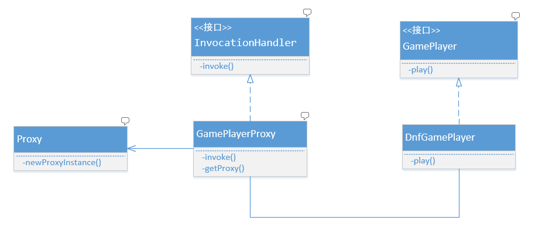

# 代理模式
代理模式亦称做委托模式，是一种使用率非常高的模式，提供一种代理来控制对象的访问。使用代理模式的目的，最主要还是在目标对象方法的基础上做
增强，这种增强的本质通常是对目标对象的方法进行拦截和过滤。

代理模式主要有 3 种类型
* 普通代理
* 强制代理
* 动态代理

## 一、普通代理
普通代理要求客户端只能访问代理角色，而不能访问真实(被代理)角色. 两种情况:

* [注入被代理对象](v1/GamePlayerProxy.java)
* [只需被代理对象的数据](v2/GamePlayerProxy.java)

## 二、强制代理
强制代理，必须通过被代理对象获取到代理，然后使用代理执行相应动作，而不能直接访问被代理对象。

[强制代理案例](forceproxy/GamePlayerProxy.java)

## 三、动态代理
动态代理是在实现阶段不关心代理谁，而在**运行阶段**决定代理哪一个对象，*Spring AOP* 的实现就是一种十分典型的动态代理。动态代理会根据
被代理的接口生成所有的方法，在 *Java* 中通过`InvocationHandler`接口来实现，所有被代理的方法都由`InvocationHandler`接管实际的处理
任务。**动态代理主要用于解决横切面编程问题，即在不改变已有代码结构的情况下增强或控制对象的行为**

[动态代理](dynamicproxy/GamePlayerProxy.java)，其类结构图如下所示

